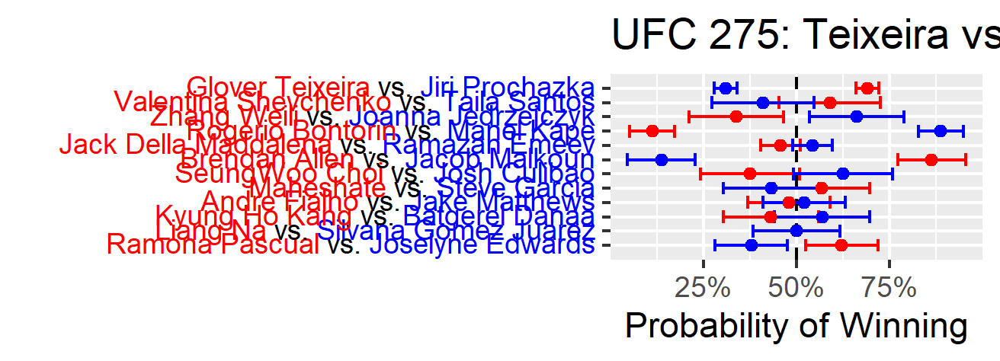

UFC Prediction Model
================

Model created from my [TidyTuesday Series](https://youtube.com/playlist?list=PLJfshcspBCYeJeO8YFT5e5HxuYOb5a_1W) that predicts the outcomes of UFC fights using machine learning from TidyModels.  
Written in R and Developed by [Andrew Couch](https://www.linkedin.com/in/andrew-couch/).

The model consists of sub-models that predict individual fight components: Knockdowns, Significant Strikes, Strikes, Takedowns, and Submission attempts. The models predict each fighter's respective components and then a final model calculates the component differentials and predicts an outcome probability.

The goal of this project was to show the entire process of starting and finishing a machine learning project. This entails data scraping, data cleaning, feature engineering, modeling, and deployment/app development.

## File Dictionary

Model Development

  - `Data_Scraping.R`
  - `Data_Cleaning.R`
  - `Feature_Engineering.RMD`
  - `Modeling.RMD`
  - `Future_Card_Predictions.RMD`
  - `Model_Pipeline.RMD`
  
Models

  - `outcome_model.RDS`
  - `kd_model.RDS`
  - `td_model.RDS`
  - `sub_model.RDS`
  - `sig_strike_model.RDS`
  - `strike_model.RDS`

App 

  - `app.R`
  - `modules.RDS`

## Card Predictions

<!-- -->  
##
<!-- -->  
##
<!-- -->  
##
<!-- -->  

## Card Component Predictions

<!-- -->  
##
<!-- -->  
##
<!-- -->  
##
<!-- -->  

## Summary Tables

<!-- -->  
##
<!-- -->  
##
<!-- -->  
##
<!-- -->  

## Gambling Tables

<!-- -->  
##
<!-- -->  
##
<!-- -->  
##
<!-- -->  
